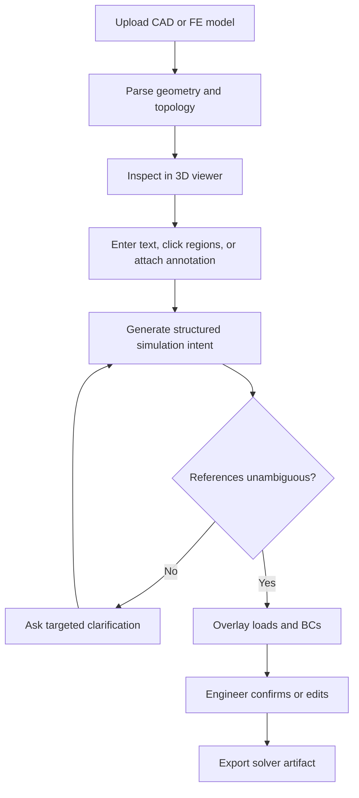

## Simulation Copilot: two-week sprint scope

The sprint should not attempt to build a general AI engineer for Abaqus, ANSYS, deal.II, and LS-DYNA. The achievable goal is a solver-neutral interaction layer that converts natural-language and image-based engineering intent into structured, spatially grounded simulation artifacts.

This narrows the broader Simulation Copilot concept to one demonstrable workflow.

### Sprint objective

Build a prototype in which an engineer can:

1. Upload a 3D part or existing finite-element model.
2. Inspect it interactively.
3. Describe loads and boundary conditions in natural language.
4. Optionally use an annotated screenshot or click on the model to disambiguate the referenced region.
5. See the interpreted load and boundary conditions overlaid on the 3D representation.
6. Review and correct the interpretation.
7. Export a solver-ready script or input fragment for one supported solver.

The core research question is:

> Can a multimodal model reliably translate informal engineering instructions and visual references into explicit, spatially grounded simulation entities?

## Target demonstration

Use a mechanically simple but geometrically nontrivial component, such as a mounting bracket with holes, fillets, and several planar faces.

Example interaction:

> Fix the two bolt holes. Apply a total downward force of 5 kN to the upper mounting face. Use steel with (E=210) GPa and (\nu=0.3). Generate a static structural analysis.

The system should:

* identify the cylindrical surfaces belonging to the two bolt holes;
* identify the intended upper mounting face;
* distinguish total force from pressure or force per node;
* construct explicit boundary-condition and load objects;
* display the selected regions and force direction;
* ask for clarification when more than one face is plausible;
* generate an Abaqus Python script or input fragment;
* retain traceability from the original instruction to every generated artifact.

An image-assisted version might include a screenshot with two holes circled and an arrow drawn on the loaded surface.

## Supported inputs

Limit the prototype to:

| Input              | Sprint support                                     |
| ------------------ | -------------------------------------------------- |
| CAD geometry       | STEP, preferred                                    |
| Surface mesh       | STL or OBJ                                         |
| FE mesh            | Abaqus INP or VTU, depending on available examples |
| Natural language   | Loads, constraints, material and analysis type     |
| Image              | Screenshot of the same model, optionally annotated |
| Direct interaction | Clicking faces, nodes or elements in the 3D viewer |

Supporting point clouds as editable simulation geometry should be deferred. A point cloud can be included as an exploratory visualization input, but automatic surface reconstruction and meshing would consume most of the sprint.

## Supported engineering concepts

### Include

* Static structural analysis only
* Linear elastic isotropic material
* Solid 3D geometry
* Face, edge, node-set and element-set selection
* Fixed displacement constraints
* Single-axis or vector displacement constraints
* Concentrated force
* Distributed surface traction
* Pressure
* Gravity
* Named material assignment
* Basic element and mesh metadata inspection
* Solver-neutral intermediate representation
* One solver export path

### Exclude

* Nonlinear material derivation
* Contact definition
* Large deformation
* Thermal-mechanical coupling
* Dynamic and explicit analysis
* Automatic mesh generation or repair
* Automatic convergence diagnosis
* Solver execution infrastructure
* Quantitative validation of simulation results
* Full support for four solver ecosystems
* Arbitrary handwritten sketches
* Point-cloud-to-CAD reconstruction

These remain part of the longer-term Simulation Copilot vision, but not the sprint acceptance criteria.

## Core user flow



The confirmation step is essential. Loads and boundary conditions should never silently move from probabilistic model output into generated solver code.

## Solver-neutral intermediate representation

The main technical deliverable should be a structured representation separating AI interpretation from solver-specific code generation.

Example:

```json
{
  "analysis": {
    "type": "static_structural",
    "units": {
      "length": "mm",
      "force": "N"
    }
  },
  "materials": [
    {
      "id": "steel",
      "model": "linear_elastic_isotropic",
      "youngs_modulus": 210000,
      "poisson_ratio": 0.3
    }
  ],
  "regions": [
    {
      "id": "bolt_holes",
      "entity_type": "cad_face",
      "entity_ids": [18, 19, 24, 25],
      "selection_method": "semantic_geometry_query",
      "confidence": 0.94
    },
    {
      "id": "upper_mounting_face",
      "entity_type": "cad_face",
      "entity_ids": [7],
      "selection_method": "multimodal_reference",
      "confidence": 0.88
    }
  ],
  "boundary_conditions": [
    {
      "type": "fixed_displacement",
      "region": "bolt_holes",
      "components": ["x", "y", "z"]
    }
  ],
  "loads": [
    {
      "type": "resultant_surface_force",
      "region": "upper_mounting_face",
      "vector": [0, -5000, 0]
    }
  ],
  "assumptions": [
    "The 5 kN value was interpreted as total force, not pressure.",
    "The model coordinate system uses positive Y upward."
  ]
}
```

Every generated object should include:

* selected geometry or mesh entity IDs;
* selection method;
* confidence;
* original supporting instruction;
* unit interpretation;
* assumptions;
* validation status.

## Spatial-grounding approach

Use deterministic geometry operations wherever possible. The language model should compose queries, not invent entity identifiers.

Examples of computable entity properties:

* surface type: plane, cylinder, cone or freeform;
* surface area;
* centroid;
* normal direction;
* bounding box;
* radius and axis for cylindrical faces;
* adjacency;
* position relative to model bounds;
* membership in a connected component.

“Fix the two bolt holes” can become a query such as:

1. Find cylindrical faces.
2. Group coaxial or connected cylindrical surfaces.
3. Filter by similar radius.
4. Find the pair matching the visual selection or positional description.
5. return concrete face IDs.

“Upper face” can be ranked using centroid position and outward normal. If two faces have similar scores, the interface should ask the user to choose between highlighted candidates.

For annotated screenshots, maintain the camera projection matrix so a 2D mark or click can be ray-cast back onto the model. This is substantially more reliable than asking a vision model to infer arbitrary 3D coordinates from an unrelated photograph.

## Prototype architecture

| Component                   | Responsibility                                                     |
| --------------------------- | ------------------------------------------------------------------ |
| Model parser                | Load STEP and selected mesh formats                                |
| Geometry index              | Extract topology, geometric properties and adjacency               |
| 3D viewer                   | Render selectable geometry and overlays                            |
| Interaction recorder        | Capture clicks, camera pose and annotated screenshots              |
| Multimodal interpreter      | Convert text and image evidence into a proposed intent             |
| Grounding engine            | Resolve semantic references to actual entity IDs                   |
| Validation layer            | Check units, missing fields, incompatible selections and ambiguity |
| Intermediate representation | Store solver-neutral simulation intent                             |
| Export adapter              | Generate one solver-specific artifact                              |
| Audit panel                 | Show assumptions, confidence and source evidence                   |

A practical stack would be:

* Python backend;
* OpenCASCADE or CadQuery for STEP topology;
* meshio for mesh formats;
* VTK/PyVista or a web viewer based on three.js;
* JSON Schema or Pydantic for the intermediate representation;
* Abaqus Python generation as the first export adapter.

Abaqus is a suitable first adapter because model construction is scriptable and generated code is easy to inspect. If Abaqus is unavailable for testing, deal.II or CalculiX provides a runnable alternative, but would change the demo emphasis.

## Required interface behavior

The prototype should visually distinguish:

* confirmed selections;
* model-proposed selections;
* ambiguous candidates;
* fixed constraints;
* displacement constraints;
* pressure;
* traction and resultant force;
* coordinate axes and load direction.

The review panel should let the user:

* replace a selected region;
* reverse or edit a load vector;
* change units;
* change total force to pressure;
* accept or reject an assumption;
* regenerate the solver artifact without repeating the conversation.

## Two-week implementation plan

Assumption: two or three builders with existing access to a multimodal model API. A solo sprint should omit annotated-image grounding or solver export.

### Days 1-2: Define the contract

* Select two reference models.
* Define 10 to 15 canonical engineering instructions.
* Define the intermediate representation and JSON Schema.
* Decide the first solver adapter.
* Establish coordinate-system and unit conventions.
* Manually author expected entity selections for evaluation.

### Days 3-4: Geometry ingestion

* Load STEP geometry.
* Assign stable identifiers to faces, edges and solids.
* Extract centroids, normals, areas, surface types and adjacency.
* Load at least one FE mesh format.
* Display the model with entity selection and highlighting.

### Days 5-6: Natural-language grounding

* Convert instructions into typed operations.
* Implement deterministic geometric queries.
* Resolve semantic regions to entity IDs.
* Add confidence and ambiguity handling.
* Validate units and distinguish force, pressure and traction.

### Days 7-8: Image and interaction grounding

* Capture viewer camera state.
* Support clicks and simple drawn annotations.
* Map 2D clicks or marks to 3D entities.
* Combine text, image evidence and geometric features.
* Display multiple candidates when selection remains ambiguous.

### Days 9-10: Artifact generation and demo hardening

* Generate one solver-specific script or input fragment.
* Add an assumptions and provenance panel.
* Create correction and confirmation controls.
* Run the evaluation set.
* Record failures and classify them.
* Prepare the final live demonstration and short video.

## Evaluation set

Create approximately 15 cases across two models:

* “Fix the bottom face.”
* “Prevent vertical motion on this face.”
* “Fix both bolt holes.”
* “Apply 2 MPa pressure to the inner cylindrical surface.”
* “Apply 5 kN downward across the top flange.”
* “Apply gravity in the negative Z direction.”
* “Use the face marked in red.”
* “Use the two holes I circled.”
* intentionally ambiguous instructions such as “fix the left side”;
* unit-sensitive instructions mixing N, kN, Pa and MPa.

For each case, store the expected:

* entity IDs;
* load or constraint type;
* vector and magnitude;
* units;
* clarification requirement;
* generated intermediate representation.

## Success criteria

The sprint succeeds if:

1. At least two 3D models can be loaded and inspected.
2. Text instructions can create grounded loads and constraints.
3. Every proposed condition refers to explicit model entity IDs.
4. The system visualizes its interpretation before export.
5. The engineer can correct a mistaken selection without rewriting the prompt.
6. Ambiguous cases trigger clarification rather than arbitrary selection.
7. At least 12 of 15 evaluation cases produce the correct structured intent after at most one clarification.
8. A confirmed model can be exported to one solver format.
9. The demonstration works end to end without manually modifying generated JSON or code.

The `12 of 15` target is a proposed sprint threshold, not an established performance benchmark.

## Stretch goals

Only attempt these after the complete primary flow works:

* Parse an existing Abaqus INP file and explain its current loads and constraints.
* Map CAD-face selections onto boundary mesh faces.
* Highlight probable mesh-quality problems using deterministic metrics.
* Run a generated open-source simulation and display displacement or stress results.
* Compare the user's instruction with an existing model and identify inconsistencies.
* Add a second solver adapter to demonstrate that the intermediate representation is genuinely solver-neutral.

## Final sprint deliverables

* Working multimodal prototype.
* Solver-neutral simulation-intent schema.
* One solver export adapter.
* Two representative example models.
* Ground-truth evaluation suite.
* Results table with failure categories.
* Architecture note documenting what was deterministic versus model-generated.
* Three-minute demonstration showing text, image annotation, 3D grounding, review and export.

The defensible outcome is not “an AI that performs FEA.” It is a validated interaction and representation layer connecting human engineering intent to explicit 3D simulation entities. That is narrow enough for two weeks and directly tests the distinctive spatial-AI component of the broader product.
